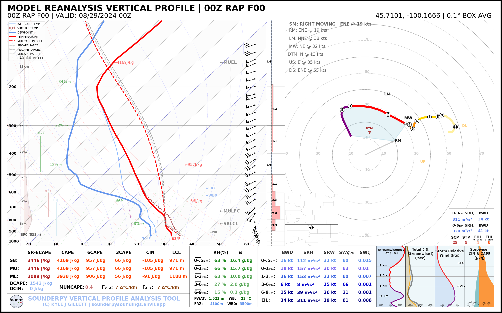

# Summary

SounderPy is a simple, open-source Python package for retrieving, processing, and
plotting atmospheric vertical profile (sounding) data. Designed for simplicity and
reliability, SounderPy aims to provide a uniform and intuitive method for sounding
analysis across various data sources. The package is available on GitHub and PyPI
and is distributed under the MIT license.

# Statement of need

Meteorological data from diverse sources are often stored in various file
formats and structured differently, posing challenges for consistent and thus
efficient data processing. This diversity complicates the thorough analysis of
atmospheric properties, which is vital in describing the past, current, and future
state of the atmosphere. The need for thorough analysis of the atmosphere's 
vertical properties has been recognized since the early 20th century, during the 
advent of "free-air" observations (soundings) using kites, balloons, and aircraft.

Normalizing the analysis of meteorological data ensures that meaningful comparisons 
can be drawn across different datasets. Reliable statistics and analogs can then be 
developed from such normalized analysis which can aid forecasters and researchers with 
pattern recognition and context. For example, comparing numerical weather prediction 
(NWP) output to past observations allows forecasters to recognize patterns and draw 
connections between historical and future events, improving predictive accuracy.

SounderPy addresses these challenges by providing simple access to multiple data sources,
including National Weather Service radiosonde observations (RAOBs), Aircraft Communications 
Addressing and Reporting System (ACARS) data, NWP forecast data, and reanalysis datasets.
Each of these data types come from unique file formats and structures, which SounderPy
processes to normalize and streamline analysis and visualization of soundings. After requesting
data, SounderPy will process and output the data as a Python dictionary, coined a "SounderPy
`clean_data` dictionary". Doing so means that every data source ends up in a uniform format for 
analysis.

# High-level API overview

Simple, intuitive classes and functions make SounderPy's API easy to understand and
use. The procedure for creating sounding figures requires only a few lines of 
straightforward API calls that first retrieve data from a source, output the `clean_data`
dictionary and plot the data on a figure. While internally this involves sophisticated
data retrieval and processing methods, extensive manipulations and calculations, and
intricate plotting routines, the user-facing interface allows this process to be completed
in just two lines of code for most integrated data sources. The simplicity of these "tools"
in SounderPy's "toolbox"allows quick and easy use for researchers, students, and hobbyists
alike. After importing the library, two lines of code create Figure 1. On top of the many
integrated data sources, SounderPy also allows users to utilize their own custom data. So 
long as a user's custom data can be manually sorted into a `clean_data` dictionary, it can
be used with SounderPy's analysis and plotting functionality. 

# Acknowledgements

The development of SounderPy relies on the robust functionality provided by
several foundational Python libraries, including MetPy, NumPy, Matplotlib,
xarray, Cartopy, SHARPpy, SciPy, and others. We gratefully acknowledge the
valuable contributions of individuals who have enhanced this project, including
Scott Thomas (National Weather Service), Daryl Herzmann (Iowa State University),
Amelia R.H. Urquhart (University of Oklahoma), Ryan Vandersmith, and many others.

This project also extends its graditude to the researchers, institutions, and 
individuals who have utilized SounderPy in their work and publications, driving
its growth and application within the meteorological community.

# References